# Pokedex Challenge App

This project consists of a SPA (Single Page Application) created with [Vue3](https://vuejs.org/guide/quick-start.html) in [Vite](https://vite.dev/guide/) with TypeScript. In addition, [Pinia](https://pinia.vuejs.org/getting-started.html) as a store manager, [VueRouter](https://router.vuejs.org/guide/) to manage the routing and history and [ViteTest](https://vitest.dev/guide/) alongside of Jest for the unit tests.

Deployment link [link](https://pokedex-4ddfe.web.app/) with [FirebaseCLI](https://firebase.google.com/docs/cli)

## Content

This proyecto has been developed and deployed as part of a technical challenge in which I had to develop a SPA with Vue3. To showcase my knowledge on REST API management I used the [PokeAPI](https://pokeapi.co/docs/v2#pokemon) as my database. This app has been heavily inspired on the Pokedex from Pokemon videogames and has followed a Jira design from it.

- SPA deployed with Vue3 on the FrontEnd.
- Pinia was used on the state managemnt.
- TailwindCSS as a CSS framework and website styles and responsiveness.
- Data fetching from PokeAPI, the infinite-scroll, details, descriptionsand types.
- Unit testing with Jest and Vite Test.
- Firebase to manage the deployment.
- GitFlow with [Semantic Commit](https://gist.github.com/joshbuchea/6f47e86d2510bce28f8e7f42ae84c716) for the git commands.

### Multimedia

<br />

#### Home Desktop

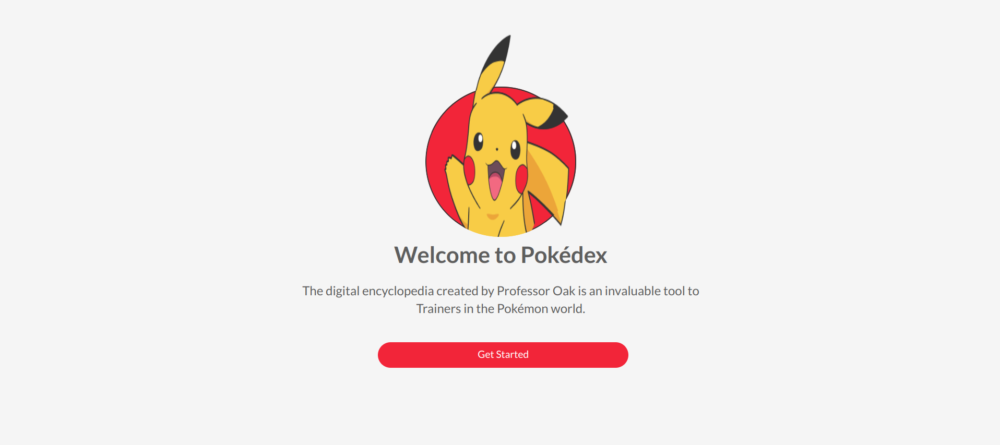

<br />

#### Home Mobile


<br />

#### Pokedex Desktop

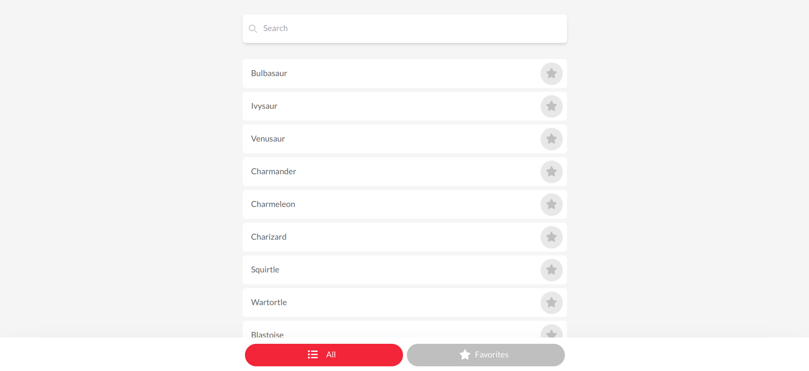

<br />

#### Pokedex Mobile

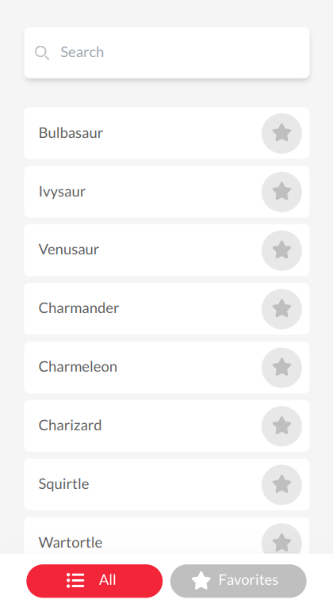

<br />

#### Search Desktop

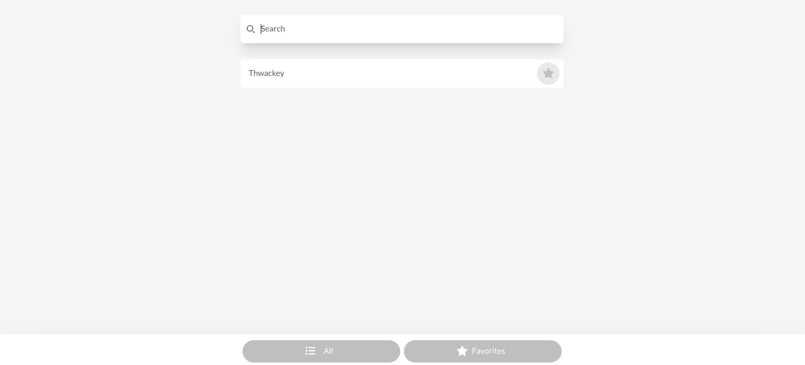

<br />

#### Search Mobile

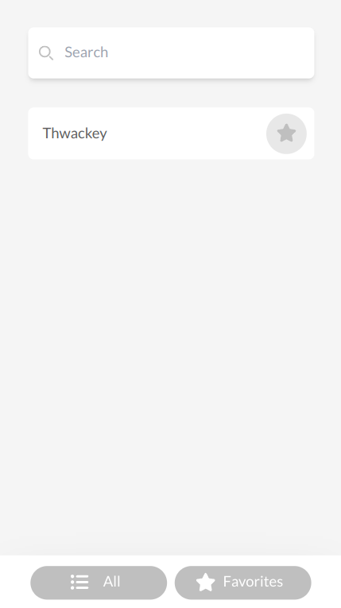

<br />

#### Favorites Desktop

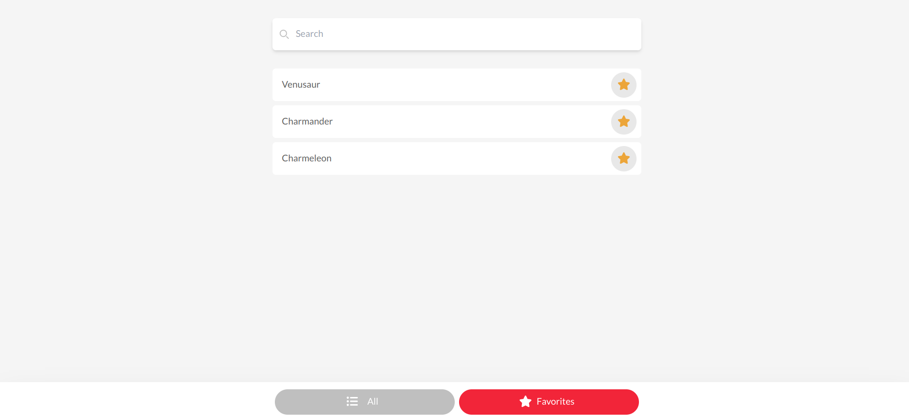

<br />

#### Favorites Mobile

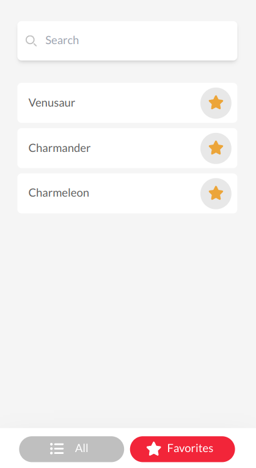

<br />

#### Details Desktop

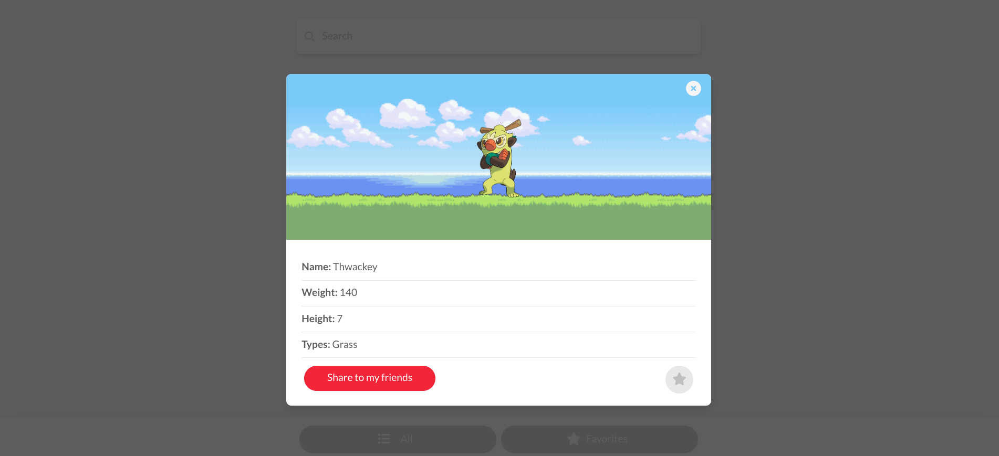

<br />

#### Details Mobile

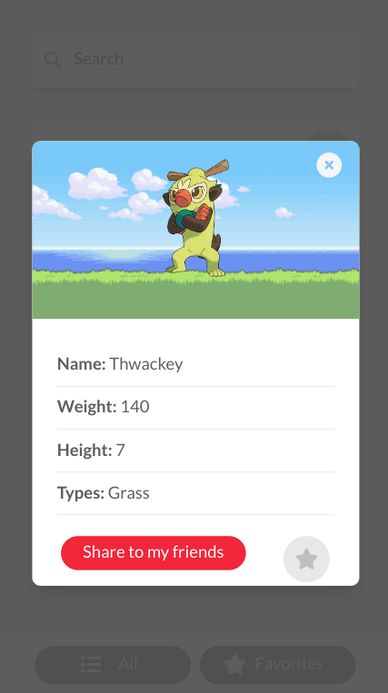

<br />

#### Lost Page Desktop

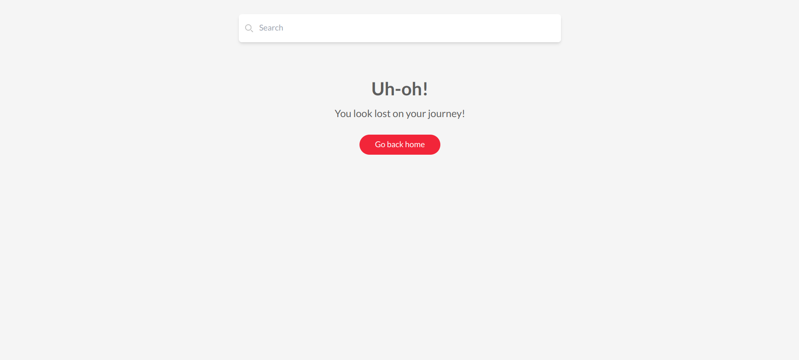

<br />

#### Lost Page Mobile

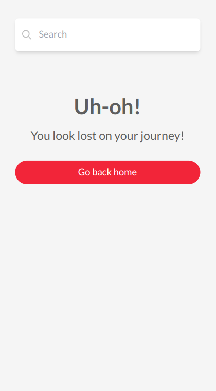

<br />

## Recommended IDE Setup

[VSCode](https://code.visualstudio.com/) + [Volar](https://marketplace.visualstudio.com/items?itemName=Vue.volar) (and disable Vetur).

## Setup / Instalation

Clone this repo from `master` branch

Set on the root folder of the proyect an `.env` file with the following variable: `VITE_API_URL="https://pokeapi.co/api/v2/pokemon"`

Then execute on your terminal:

```
npm install
```

### Locally compile for development

```
npm run serve
```

### App compilation for produccion on `dist` folder

```
npm run build
```

### Run the tests

```
npm run test:unit
```
